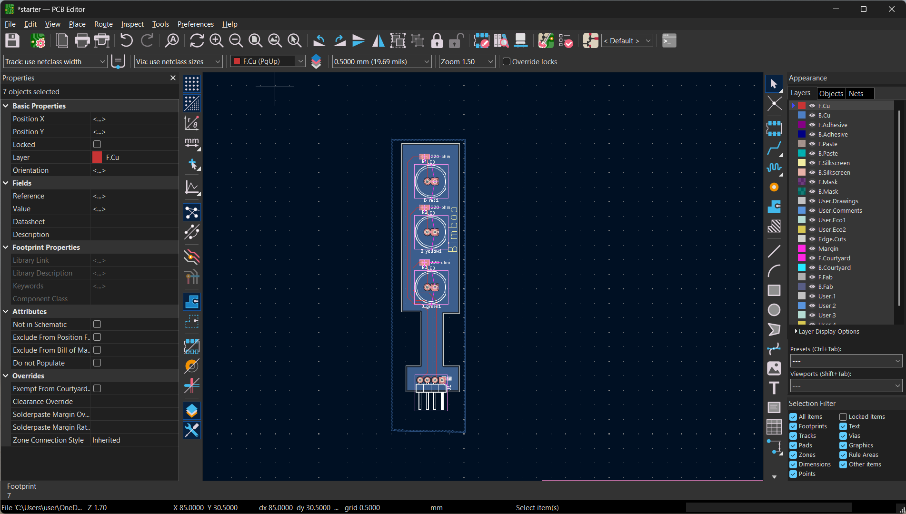
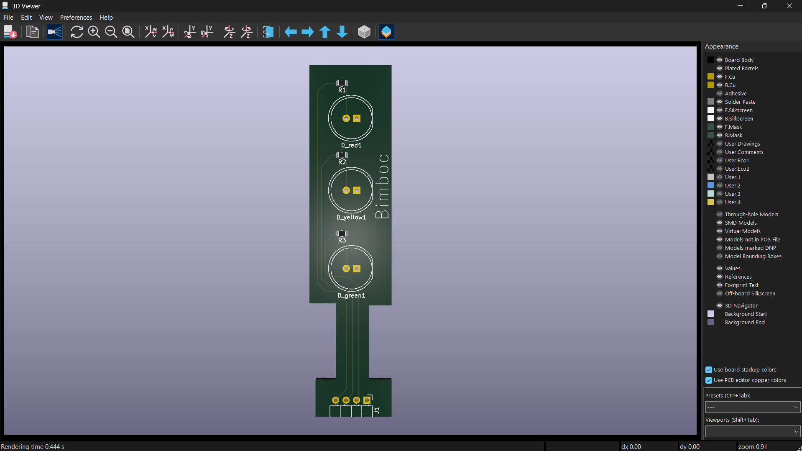
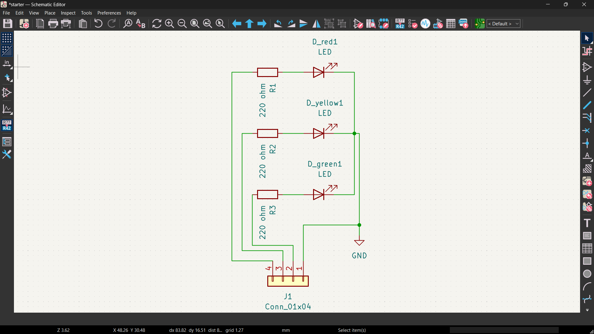

# 🚦 Traffic Light LED Module PCB

A custom Traffic Light LED Indicator PCB designed using KiCad.

## Overview

This project consists of a compact three-LED indicator module featuring:

- 🔴 Red LED
- 🟡 Yellow LED
- 🟢 Green LED

Each LED is driven through a 220 Ω current-limiting resistor and connected through a 4-pin header interface.

## Features

- Custom PCB designed in KiCad
- Compact PCB layout
- 4-pin connector interface
- ERC verified
- DRC verified
- 3D visualization completed

## PCB Layout



## 3D View



## 3D View (With Components)


## Schematic



## Project Files

- PCB Layout (`.kicad_pcb`)
- Schematic (`.kicad_sch`)
- KiCad Project (`.kicad_pro`)

## Tools Used

- KiCad 10
- GitHub

## Author

**Tejwin Linto**

Electrical and Electronics Engineering Student

### Interests

- Embedded Systems
- PCB Design
- IoT Development
- Hardware Design
- Microcontrollers

## Repository Structure

```text
Traffic-Light-LED-Module-PCB
│
├── README.md
├── LICENSE
│
└── KiCad
    ├── traffic light module.kicad_pcb.kicad_pcb
    ├── traffic light module.kicad_pro.kicad_pro
    ├── traffic light module.kicad_sch.kicad_sch
    ├── pcb-layout.png
    ├── pcb-3d-view.png
    ├── pcb-3d-view components.png
    └── schematic.png
```

## License

This project is released under the MIT License.
